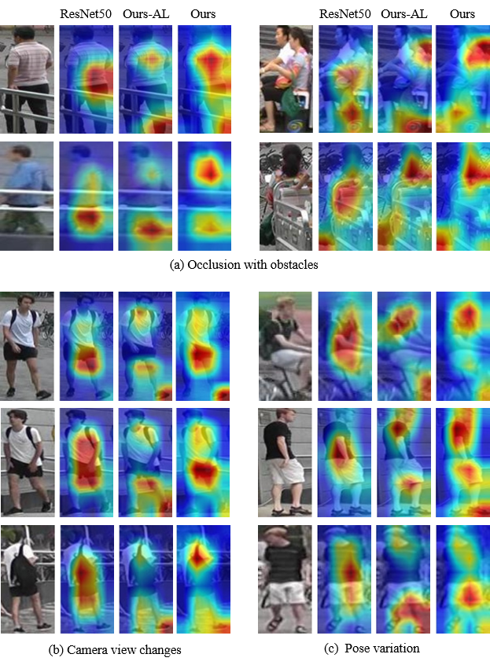

# UANet: Uniformity Attention Learning-based Siamese Network for Person Re-Identification
Pytorch implementation of "Uniformity Attention Learning-based Siamese Network for Person Re-Identification"

### Overall

### Architecture

### Qualitative Evaluation

