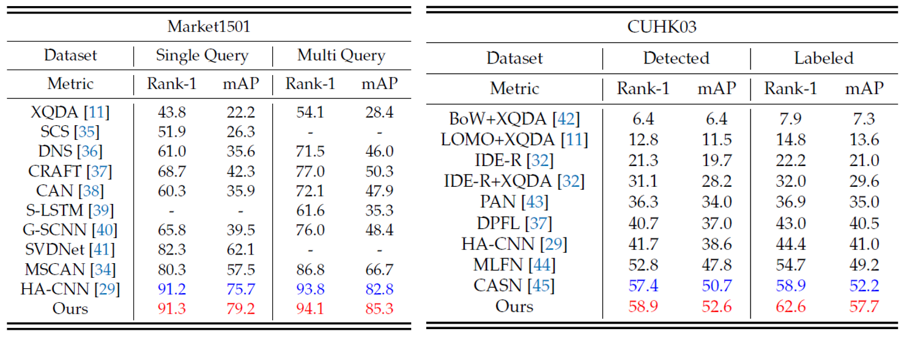

# UANet: Uniformity Attention Learning-based Siamese Network for Person Re-Identification
Pytorch implementation of "Uniformity Attention Learning-based Siamese Network for Person Re-Identification"

### Overall
<p align="center">
  
</p>

### Architecture
<p align="center">
  
</p>

### Qualitative Evaluation
<p align="center">
  
</p>

### Quantitative Evaluation
<p align="center">
  
</p>


## Resources
* [Zhedong Zheng](https://github.com/layumi) provides a [strong Pytorch baseline](https://github.com/layumi/Person_reID_baseline_pytorch) ([](https://github.com/layumi/Person_reID_baseline_pytorch))


## Getting Started
### Installation

- Clone this repository
```
git clone https://github.com/DasolJeong/UANet.git
```


### Dataset & Preparation
Download [Market1501 Dataset](https://drive.google.com/drive/folders/1hUA8A9yNHPoD_rYdvom3BYPX0jbLkZa-?usp=sharing)

Preparation: Put the images with the same id in one folder. You may use 
```bash
python prepare.py
```
Remember to change the dataset path to your own path.


### Run experiments from pretrained weight

- Download pretrained weight from the link. [[Google Drive]](https://drive.google.com/drive/folders/1RISrVEaW2OvmSnH28gDGxrhIWKJzYIV6?usp=sharing)


### Train
Train a model by
```bash
python train.py --gpu_ids 0 --name ft_uanet --train_all --batchsize 32  --data_dir your_data_path
```
`--gpu_ids` which gpu to run.

`--name` the name of model.

`--data_dir` the path of the training data.

`--train_all` using all images to train. 

`--batchsize` batch size.

`--erasing_p` random erasing probability.

Train a model with random erasing by
```bash
python train.py --gpu_ids 0 --name ft_uanet --train_all --batchsize 32  --data_dir your_data_path --erasing_p 0.5
```


### Test
Use trained model to extract feature by
```bash
python test.py --gpu_ids 0 --name ft_uanet --test_dir your_data_path  --batchsize 32 --which_epoch 79
```
`--gpu_ids` which gpu to run.

`--batchsize` batch size.

`--name` the dir name of trained model.

`--which_epoch` select the i-th model.

`--data_dir` the path of the testing data.


### Evaluation
```bash
python evaluate.py
```
It will output Rank@1, Rank@5, Rank@10 and mAP results.
You may also try `evaluate_gpu.py` to conduct a faster evaluation with GPU.


